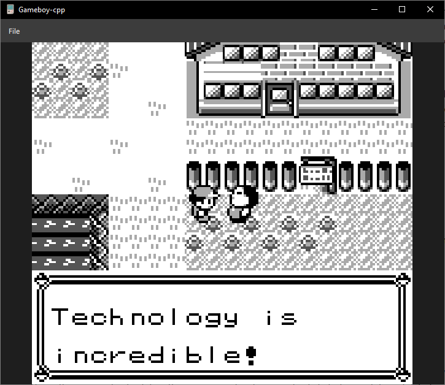
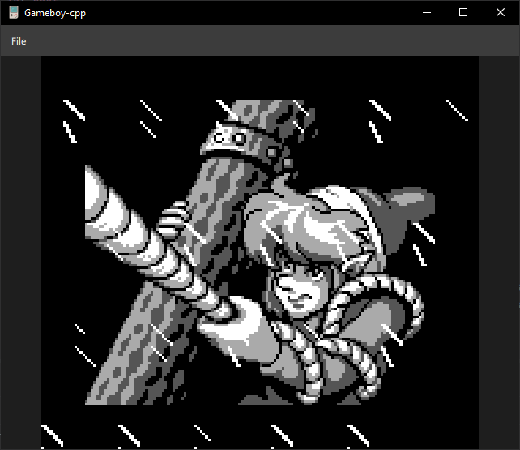
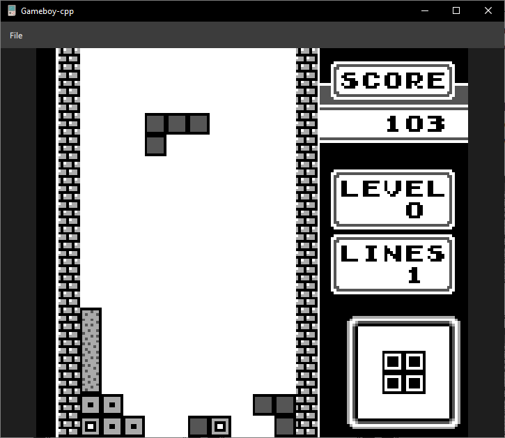
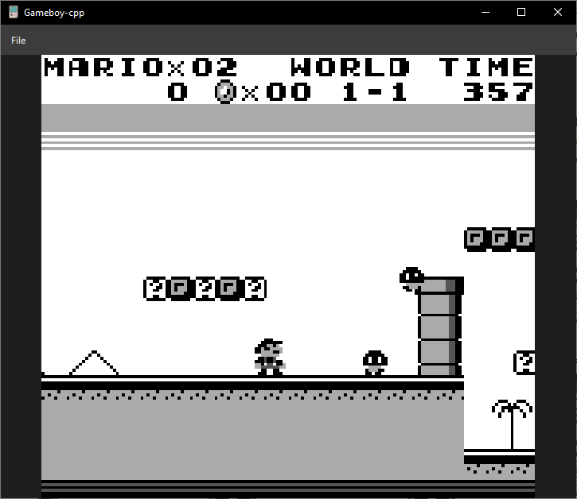

# gameboy-cpp
Yet another Game Boy emulator written in C++. 
This project is mainly an exercise for myself to get to know all the new features added
in the latest C++ standards (20 and 23).
The code has been entirely written with modules and concepts as the main focus.
You can find more in-depth discussion about the development process
[on my blog](https://thordreck.github.io/programming/c++/2026/05/06/gameboy-cpp-emulator.html).

## Screenshots

<p align="center">
  
  
</p>

<p align="center">
  
  
</p>

## Building 

The project has only been tested using CMake, Ninja and msvc under Windows.
It should be pretty straightforward to build it with other configurations, as long
as the compiler supports modules and `import std` directives.

Ensure dependency submodules are initialized by running:

```
git submodule update --init --recursive
```

A series of CMake presets have been provided for different configurations.
To configure the project with [SDL3](https://github.com/libsdl-org/SDL)
and [imgui](https://github.com/ocornut/imgui) support in release mode run:

```
cmake --preset "ninja-no-profiling-sdl-release"
cmake --build --preset "ninja-no-profiling-sdl-release"
```

Alternatively, you can compile it with Qt as the frontend, but you will need to
install Qt (v6.11+) manually using the official installer and provide the path to it yourself:

```
cmake --preset "ninja-no-profiling-qt-release" -DCMAKE_PREFIX_PATH=<path/to/qt/installation>
cmake --build --preset "ninja-no-profiling-qt-release"
```

For example for Qt6.11 under Windows and msvc, 
the default installation path would be `C:/Qt/6.11.0/msvc2022_64`.

## Acknowledgements

* [Pan Docs](https://gbdev.io/pandocs/) has been my main go-to reference.
* [The complete technical gb reference](https://gekkio.fi/files/gb-docs/gbctr.pdf) has also been an invaluable source of information as well.
* [Blargg](https://github.com/retrio/gb-test-roms) test suite helped me greatly to get the cpu up running and achieve cycle accuracy. 
* The comprehensive [mooneye](https://github.com/Gekkio/mooneye-test-suite/) test suite.
* [r/emudev](https://www.reddit.com/r/EmuDev/) and its Discord channel is full of hidden knowledge gems.
 
## TO-DO 

- [ ] Pass remaining [mooneye](https://github.com/Gekkio/mooneye-test-suite) tests.
- [ ] Refactor graphics and interrupt modules.
- [ ] Sound.
- [ ] Save files/state support.
- [ ] Add CI support and automatic releases.
- [ ] Add performance tests.
- [ ] Support for additional memory bank controllers.
- [ ] PS Vita port?